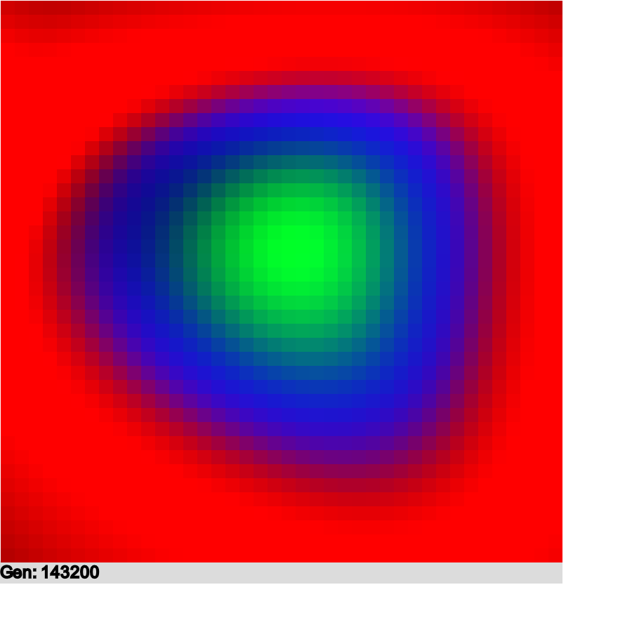

# jsNeuralNetCircleTest
A feed forward neural net implementation built int JavaScript using GPU.js. The neural net tries to draw a green circle with a blue ring and a red background. In order to accomplish this, the net checks any given point on the screen and propagates the correct color. 

