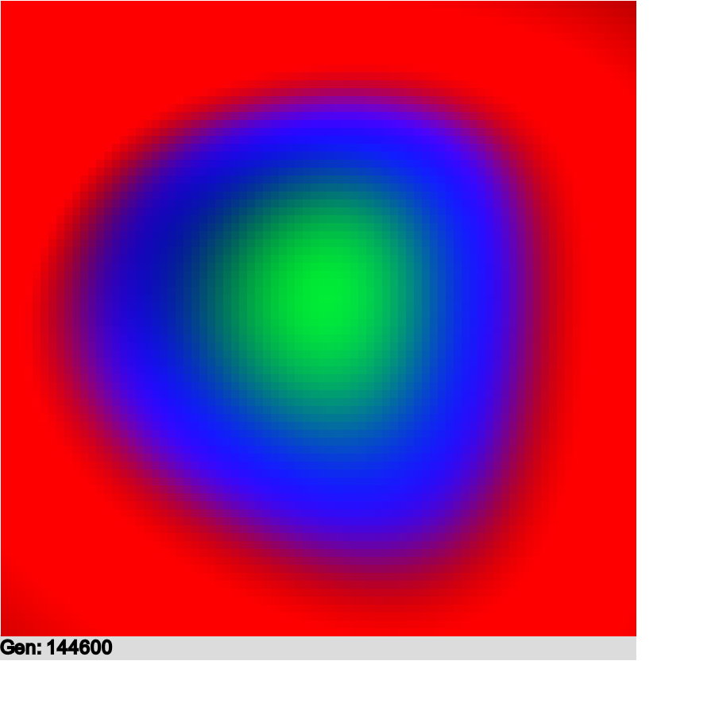

# jsNeuralNetCircleTest
A feed forward neural net implementation built int JavaScript using GPU.js. The neural net tries to draw a green circle with a blue ring and a red background. In order to accomplish this, the net checks any given point on the screen and propagates the correct color. 

# We can see the output of the latent space for the net
Using the soft plus activation function, we see an interesting interpolation of color in our latent space.

# Latent Space with ReLU activation frunction
Because of the somewhat linear nature of ReLU, the contours of the latent space are much more jagged.

